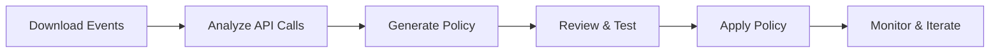

# AWS Security Toolkit

A comprehensive suite of Python scripts for AWS security analysis, CloudTrail monitoring, and IAM policy management. This toolkit helps you implement least privilege access, analyze CloudTrail events, and enforce MFA policies across your AWS environment.

## 🔧 Tools Overview

| Script | Purpose | Input | Output |
|--------|---------|-------|--------|
| `get_events.py` | Download CloudTrail events from AWS API | Search parameters | JSON file with events |
| `get_unique_events.py` | Analyze CloudTrail events for unique API calls | CloudTrail JSON or live download | Analysis report + JSON |
| `least_privilege_policy_generator.py` | Generate minimal IAM policies from usage | CloudTrail analysis JSON | Ready-to-use IAM policy |
| `mfa_enforcement_checker.py` | Check MFA enforcement across IAM users | AWS account access | CSV report + console output |

## 📋 Requirements

### Python Dependencies
```bash
pip install boto3 botocore
```

**Minimum Versions:**
- Python 3.10+
- boto3 >= 1.35.76
- botocore >= 1.35.82

### AWS Credentials
Configure AWS credentials using one of these methods:
```bash
# Option 1: AWS CLI
aws configure

# Option 2: Environment variables
export AWS_ACCESS_KEY_ID=your_access_key
export AWS_SECRET_ACCESS_KEY=your_secret_key
export AWS_DEFAULT_REGION=us-east-1

# Option 3: IAM roles (if running on EC2/Lambda)
```

### Required AWS Permissions

#### For CloudTrail Analysis (`get_events.py`, `get_unique_events.py`):
```json
{
  "Version": "2012-10-17",
  "Statement": [
    {
      "Effect": "Allow",
      "Action": [
        "cloudtrail:LookupEvents"
      ],
      "Resource": "*"
    }
  ]
}
```

#### For Policy Generation (`least_privilege_policy_generator.py`):
- No additional AWS permissions required (processes local files)

#### For MFA Enforcement Checking (`mfa_enforcement_checker.py`):
```json
{
  "Version": "2012-10-17",
  "Statement": [
    {
      "Effect": "Allow",
      "Action": [
        "iam:ListUsers",
        "iam:ListUserPolicies",
        "iam:GetUserPolicy",
        "iam:ListAttachedUserPolicies",
        "iam:ListGroupsForUser",
        "iam:ListGroupPolicies",
        "iam:GetGroupPolicy",
        "iam:ListAttachedGroupPolicies",
        "iam:GetPolicy",
        "iam:GetPolicyVersion",
        "iam:GetLoginProfile",
        "iam:ListMFADevices"
      ],
      "Resource": "*"
    }
  ]
}
```

## 🚀 Quick Start

### 1. Download CloudTrail Events
```bash
python get_events.py
```
**Interactive prompts:**
- Choose lookup attribute (Username, EventName, etc.)
- Set time range (last X days, 90 days, or custom)
- Specify max events or 'all'
- Set output filename

**Example:**
```
🔍 CLOUDTRAIL EVENT LOOKUP
Choose lookup attribute:
  1. Username
  2. AccessKeyId
  ...
Enter your choice (1-8): 1
Enter the value for Username: john.doe
```

### 2. Analyze Events for Unique API Calls
```bash
python get_unique_events.py
```
**Two modes:**
1. **Download & Analyze** - Uses `get_events.py` to fetch then analyze
2. **Analyze Existing Files** - Process local JSON files

**Output:** Detailed analysis showing:
- Unique API calls with usage counts
- Resource ARNs accessed
- Resource names and types
- Request parameters

### 3. Generate Least Privilege Policies
```bash
python least_privilege_policy_generator.py
```
**Input:** CloudTrail analysis JSON file  
**Output:** Ready-to-paste IAM policy JSON

**Example workflow:**
```bash
# Step 1: Download events
python get_events.py  # Creates: cloudtrail_events.json

# Step 2: Analyze events  
python get_unique_events.py  # Creates: cloudtrail_analysis.json

# Step 3: Generate policy
python least_privilege_policy_generator.py  # Creates: iam_policy.json
```

### 4. Check MFA Enforcement
```bash
python mfa_enforcement_checker.py
```
**Automatically scans all IAM users and checks:**
- Console access enabled
- MFA device configured
- MFA enforcement policies (direct or inherited)

## 📊 Usage Examples

### Example 1: Analyze API Usage for a Specific User
```bash
# Download last 30 days of events for user 'alice'
python get_events.py
# Choose: Username -> alice -> Last 30 days -> all events

# Analyze the downloaded events
python get_unique_events.py
# Choose: Download and analyze -> (uses previous search)

# Generate minimal policy
python least_privilege_policy_generator.py
# Input: cloudtrail_analysis.json
# Output: iam_policy.json (ready for AWS)
```

### Example 2: Analyze Existing CloudTrail Logs
```bash
# If you have existing CloudTrail JSON files
python get_unique_events.py
# Choose: Analyze existing files
# Enter directory: /path/to/cloudtrail/logs/
# Enter files: *.json
```

### Example 3: Organization-Wide MFA Audit
```bash
# Check all users for MFA enforcement
python mfa_enforcement_checker.py
# Output: Console report + CSV file with timestamp
```

## 📁 File Formats

### CloudTrail Events JSON (from `get_events.py`)
```json
{
  "SearchParameters": {
    "AttributeKey": "Username",
    "AttributeValue": "alice",
    "StartTime": "2025-06-01T00:00:00Z",
    "EndTime": "2025-07-01T00:00:00Z"
  },
  "Summary": {
    "TotalEvents": 150,
    "RetrievedAt": "2025-07-01T10:30:00Z"
  },
  "Events": [...]
}
```

### Analysis JSON (from `get_unique_events.py`)
```json
{
  "analysis_timestamp": "2025-07-01T10:45:00Z",
  "total_unique_api_calls": 25,
  "api_calls": {
    "s3:GetObject": {
      "service": "s3",
      "event_name": "GetObject",
      "count": 45,
      "resource_arns": ["arn:aws:s3:::my-bucket/*"],
      "resource_names": ["my-bucket"],
      "resource_types": ["AWS::S3::Object"],
      "request_parameters": ["bucketName=my-bucket"]
    }
  }
}
```

### Generated IAM Policy (from `least_privilege_policy_generator.py`)
```json
{
  "Version": "2012-10-17",
  "Statement": [
    {
      "Effect": "Allow",
      "Action": ["s3:GetObject", "s3:ListBucket"],
      "Resource": [
        "arn:aws:s3:::my-bucket",
        "arn:aws:s3:::my-bucket/*"
      ]
    }
  ]
}
```

## 🔍 Advanced Features

### CloudTrail Event Filtering
The `get_events.py` script supports various lookup attributes:
- **Username** - Find events by IAM user
- **AccessKeyId** - Track specific access key usage
- **EventName** - Filter by API operation (e.g., "AssumeRole")
- **EventSource** - Filter by AWS service (e.g., "s3.amazonaws.com")
- **ResourceName** - Find events affecting specific resources

### Policy Intelligence
The policy generator includes:
- **Service-specific logic** - S3 bucket vs object permissions
- **Wildcard detection** - Automatically uses `"*"` for list/describe operations
- **Resource grouping** - Combines similar permissions into statements
- **Action mapping** - Maps CloudTrail events to required IAM actions

### MFA Enforcement Detection
The MFA checker identifies:
- **Direct policies** - Inline and managed policies on users
- **Inherited policies** - Through IAM group membership
- **Policy patterns** - Deny statements with MFA conditions
- **Console vs API** - Separate checks for different access methods

## 🛠️ Troubleshooting

### Common Issues

#### "No credentials found"
```bash
# Configure AWS credentials
aws configure
# OR set environment variables
export AWS_ACCESS_KEY_ID=xxx
export AWS_SECRET_ACCESS_KEY=xxx
```

#### "Access Denied" errors
- Verify IAM permissions (see Requirements section)
- Check if using the correct AWS region
- Ensure CloudTrail is enabled in your account

#### "No events found"
- Try a broader time range (e.g., last 90 days)
- Verify the username/attribute value is correct
- Check if CloudTrail was enabled during the time period

#### Policy generation issues
- Ensure the analysis JSON file exists and is valid
- Try re-running the analysis step
- Check file permissions for output directory

### Debug Mode
For verbose output, modify the scripts to include debug information:
```python
# Add to any script for more detailed logging
import logging
logging.basicConfig(level=logging.DEBUG)
```

## 📈 Best Practices

### 1. Security Analysis Workflow


### 2. Regular Auditing
- Run MFA enforcement checks monthly
- Analyze CloudTrail events quarterly for policy updates
- Review generated policies before applying to production

### 3. Least Privilege Implementation
- Start with a 30-90 day analysis period
- Test generated policies in development first
- Use conditions to further restrict access (time, IP, etc.)
- Monitor CloudTrail after policy changes for denied actions

## 🤝 Contributing

### Development Setup
```bash
git clone <repository>
cd aws-security-toolkit
pip install -r requirements.txt
```

### Code Style
- Follow PEP 8 style guidelines
- Use type hints (`from __future__ import annotations`)
- Include docstrings for all functions
- Add error handling for AWS API calls

### Testing
```bash
# Run linting
flake8 *.py
ruff check *.py

# Test with sample data
python get_unique_events.py  # Mode 2: analyze existing files
```

## 📄 License

This project is licensed under the MIT License. See the [LICENSE](LICENSE) file for details.

## ⚠️ Important Security Notes

1. **Review Generated Policies** - Always review IAM policies before applying them to production environments

2. **Test First** - Apply policies to test users/roles first to ensure they work as expected

3. **Monitor Access** - Continue monitoring CloudTrail after applying policies to catch any denied actions

4. **Keep Updated** - Re-run analysis periodically as user access patterns change

5. **Backup Policies** - Keep backups of existing policies before making changes

6. **Compliance** - Ensure generated policies meet your organization's compliance requirements

## 📞 Support

For issues, questions, or contributions:
- Open an issue in the repository
- Check the troubleshooting section above
- Review AWS CloudTrail and IAM documentation

---
